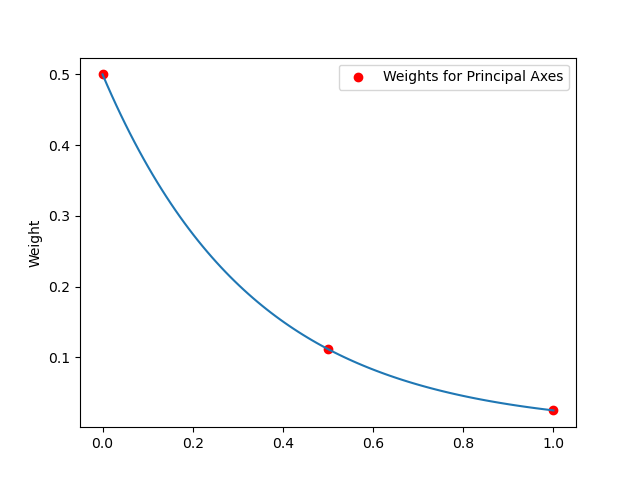
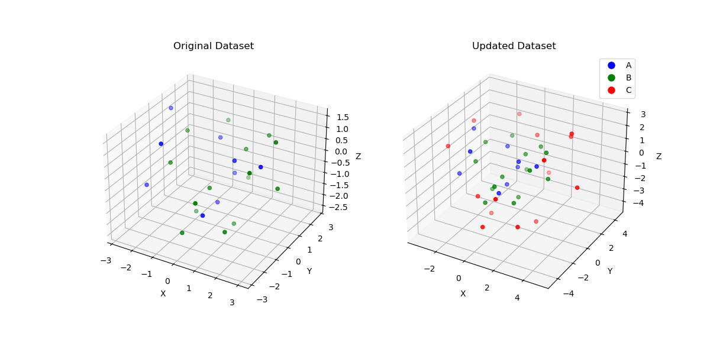

# **Script Documentation**

## **Overview**
This script processes a 3D dataset to add offset points to a subset of data based on a specified label. The offset is applied in an outward direction determined by the principal components of the data. The script provides options for visualizing the results and saving the output to a file.

---

## **Features**
1. **Add Offset Points**:
   - Offsets points away from point cloud.
2. **Generalizable to Irregular Shapes**:
   - Adjusts for local point geometry using K-nearest Neighbor analysis and Principal Component Analysis (PCA).
3. **Generalizeable to N-dimensional Input**:
   - Can add points in N-dimensional space.
4. **Accounts for All Points in Cloud**:
   - Point cloud is redefined any time a new point is added for maximum point dispursion.
5. **Visualization**:
   - Generates 3D scatter plots of the original and updated datasets. 
6. **Logging**:
   - Provides detailed logs of operations and potential errors for debugging.
7. **Command-Line Interface**:
   - Flexible control over inputs, outputs, and parameters using CLI arguments.

**Complexity**: $O(n_{neighbors}\cdot D^2)$ where $n_{neighbors}$ is the number of neighbors to search through for each point and $D$ is data dimensionality (e.g. 3 for 3D)
---
## Dependencies

- `numpy`
- `pandas`
- `scikit-learn`
- `argparse`
- `matplotlib`
- `os`
  
## Running script
The script can be run within a Docker image. 
```bash
docker build -t offset-points-generator .
docker run --rm -v "$(pwd)/outputs:/app/outputs" offset-points-generator
```
---

## Workflow

### Input File Reading:
Reads the input dataset from a space-separated text file. Dataset is stored as a `pandas` DataFrame with columns: `label`,`x`,`y`,`z`.
For larger dimensionality data, an optional argument `point_cols` can be defined to label features accordingly.

### Offset Point Calculation:
Calculates the outward vector for each point "B" by using the centroid of the point cloud.

$$
\hat v_{outward} = \frac{r_{B} - r_{centroid}}{|r_{B} - r_{centroid}|}
$$

here, 
- $r_{B}$ is the coordinates of a "B" point of interest
- $r_{centroid}$ is the coordinates of the centroid of all data (computed using the average of all coordinates).

To account for local geometry variability, Principal Component Analysis (PCA) is conducted for each point "B" (`sklearn.decomposition.PCA`) on its $n_{neighbors}$ nearest neighbors (`sklearn.neighbors.NearestNeighbors`). The number of components used for PCA is the same as data dimensionality (i.e. 3 for 3D data). 

Each principal component is assigned an "importance" weight based on its explained variance ratio ($\lambda$). 

$$
d_{offset} = \hat v_{outward} + \frac1{\sum_{i=1}^n\lambda_i}\begin{bmatrix}\lambda_1 \\ \lambda_2 \\ \dots \\ \lambda_n \end{bmatrix} \cdot \begin{bmatrix}\textbf{u}_1 \\ \textbf{u}_2 \\ \dots \\ \textbf{u}_n \end{bmatrix}
$$

and normalized to get a unit vector...


$$
\hat d_{offset} = \frac{d_{offset}}{|d_{offset}|}
$$

here, 
- $\textbf{u}_1, \dots, \textbf{u}_n$ are the principal axes determined by PCA. The number of components $n$ is the same as data dimensionality.
- $\lambda_1,\dots,\lambda_n$ are the explained variance ratios for their corresponding principal components.
  


### Output File Writing:
Saves the updated dataset, including new offset points, to the specified output file.



Interactive plots:
[Interactive Plotly Chart Original Dataset](plots/original_3d_figure.html)
[Interactive Plotly Chart Updated Dataset](plots/updated_3d_figure.html)


## Error Handling

- `Missing Input File`: Logs an error and exits if the file is not found.
- `Invalid Parameters`: Validates all inputs and raises appropriate exceptions for invalid values.
- `Processing Errors`: Logs errors for individual points but continues processing the rest.

## Extensibility

- **Support for Higher Dimensions**: Modify `--point-cols` to handle additional dimensions.
- **Adjust Offset Behavior**: Customize the cutoff function to change how the offset is calculated.
- **Dynamic Labels**: Use custom labels for both input and output points.

## File Formatting 
### Input File Format

The input file must be space-separated and contain:

A label column (indicating the label of each point).
Coordinate columns for the 3D space (default: x, y, z).
Example Input File (input.txt):
```
A 1.0 2.0 3.0
B 4.0 5.0 6.0
A 7.0 8.0 9.0
...
B 10.0 11.0 12.0
```
### Output File Format

The output file is a tab-separated text file containing:

Original points from the dataset.
Newly calculated offset points with an updated label (default: C).
Example Output File (output.txt):
```
label    x     y     z
A        1.0   2.0   3.0
B        4.0   5.0   6.0
A        7.0   8.0   9.0
...
B        10.0  11.0  12.0
C        5.2   6.3   7.1
...
C        11.5  12.6  13.2
```
## Command-Line Arguments

Run the script with the following command-line options:

### Optional Arguments
- `-i` or `--input`: Path to the input text file. (Default: `cdd.txt`)
- `-d` or `--offset-magnitude`: Magnitude of the offset. (Default: `2.0`)
- `-o` or `--output`: Path to the output text file. (Default: `out.txt`)
- `-n` or `--neighbors`: Number of neighbors to use for local geometry PCA. (Default: `5`)
- `--point-cols`: List of column names representing the coordinates. (Default: `['x', 'y', 'z']`)
- `-l` or `--label`: Label of the points to offset. (Default: `'B'`)
- `--offset-label`: Label to assign to the offset points. (Default: `'C'`)
### Example Command
```bash
python script.py -i cdd.txt -o out.txt -d 3.0 -a 0.5 --point-cols x y z -l B --offset-label C
```
## Example Workflow

### Input File (`cdd.txt`):
```
A 1.0 2.0 3.0
B 4.0 5.0 6.0
A 7.0 8.0 9.0
B 10.0 11.0 12.0
```
### Command:

`python script.py -i cdd.txt -o out.txt -d 3.0 -a 0.5 --point-cols x y z -l B --offset-label C`

### Output File (`out.txt`):
```
label    x     y     z
A        1.0   2.0   3.0
B        4.0   5.0   6.0
A        7.0   8.0   9.0
B        10.0  11.0  12.0
C        5.2   6.3   7.1
C        11.5  12.6  13.2
```

## **Function Documentation**

### `find_offset_direction`
Finds the direction pointing away from point cloud using the general outward vector from point cloud center, adjusted with local PCA at each point "B" to account for non-spherical point clouds.
#### **Parameters**
- `df` (pd.DataFrame): Input DataFrame containing 3D points and labels.
- `point` (pd.Series): The specific point for which the offset direction is to be calculated. This should correspond to a row in the DataFrame.
- `n_neighbors` (int, optional): Number of neighbors to use for local geometry around point (default: `5`).
- `point_cols` (list, optional): Column names for 3D coordinates (default: `['x', 'y', 'z']`).

#### **Returns**
- `np.ndarray`: A normalized (unit vector) representing the offset direction for the input point. The vector incorporates the outward direction from the centroid and local geometry information.

### `add_offset_points`
Applies offsets to points in a DataFrame based on PCA and outward vectors.

#### **Parameters**
- `df` (pd.DataFrame): Input DataFrame containing 3D points and labels.
- `offset_magnitude` (float): Magnitude of the offset.
- `point_cols` (list, optional): Column names for 3D coordinates (default: `['x', 'y', 'z']`).
- `initial_label` (str, optional): Label of points to offset (default: `'B'`).
- `offset_label` (str, optional): Label for new offset points (default: `'C'`).
- `n_neighbors` (int, optional): Number of neighbors to use for local geometry around point (default: `5`).

#### **Returns**
- `pd.DataFrame`: Updated DataFrame with offset points added.

#### **Raises**
- `TypeError`: If `df` is not a DataFrame.
- `ValueError`: If `offset_magnitude <= 0`.
- `KeyError`: If required columns are missing in the DataFrame.

---

### `plot_coordinates`
Creates 3D scatter plots of the original and updated datasets.

#### **Parameters**
- `df` (pd.DataFrame): Original dataset.
- `updated_df` (pd.DataFrame): Updated dataset.

#### **Notes**
- Saves the plot as `3d_scatter_plots.png`.

---

### `main`
Entry point for the script. Parses command-line arguments and orchestrates the workflow.


### License

This script is open-source and can be freely modified or extended for your use. Not for commercial use.


